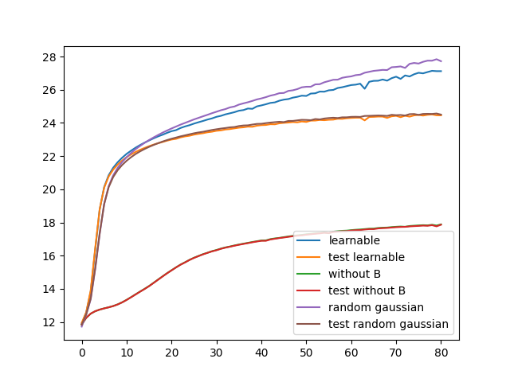
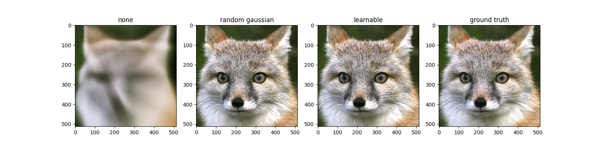

# Fourier Feature Mapping
This is an implementation of the paper [Fourier Features Let Networks Learn High Frequency Functions in Low Dimensional Domains](https://arxiv.org/pdf/2006.10739.pdf) using TensorFlow 2.3.

I also added a learnable parameter instead of using a fixed random Gaussian parameter.
The PSNR curve over optimization steps(x25):

</img>

The output images of each method:

</img>
